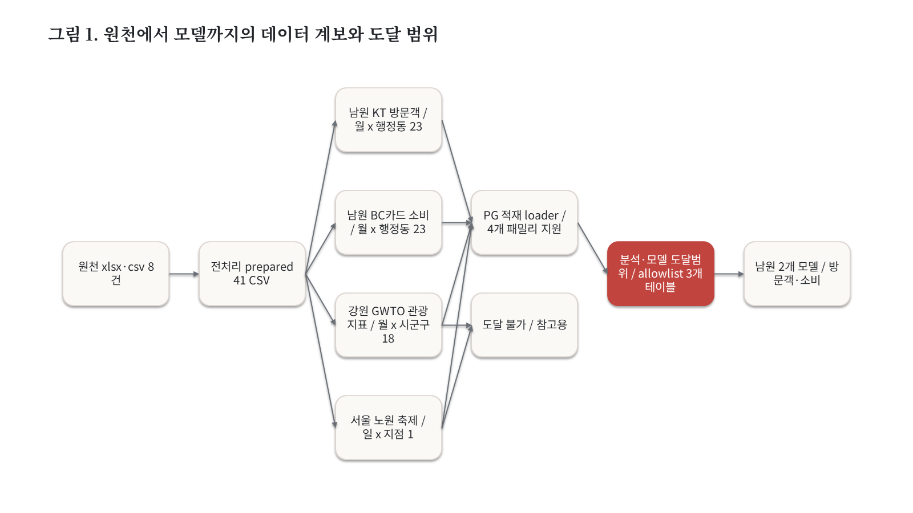
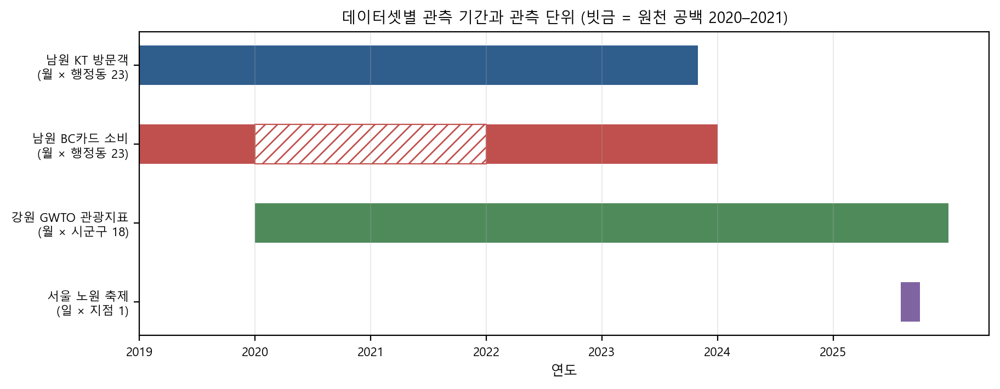
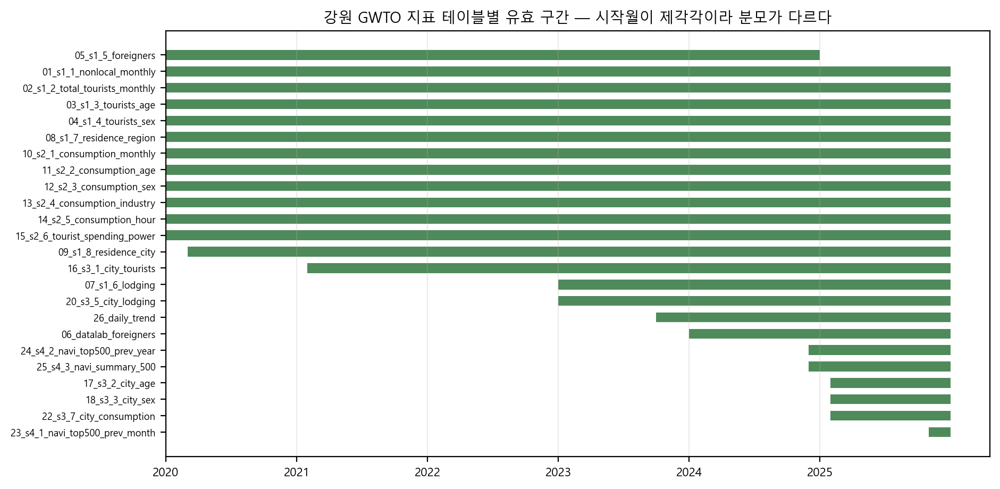
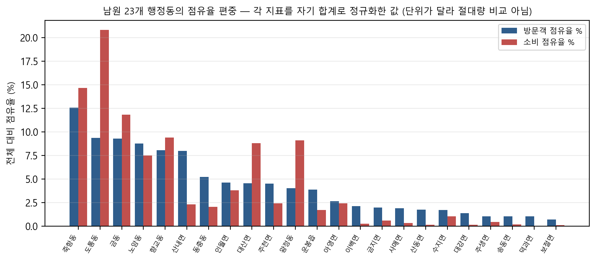
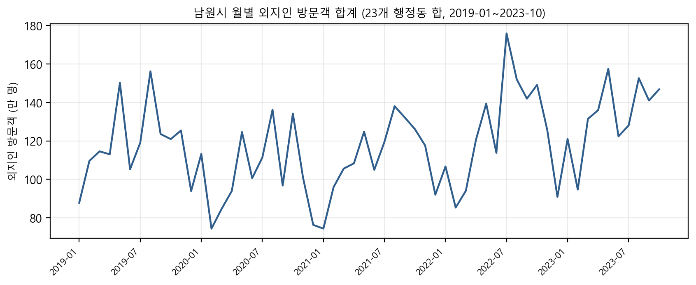
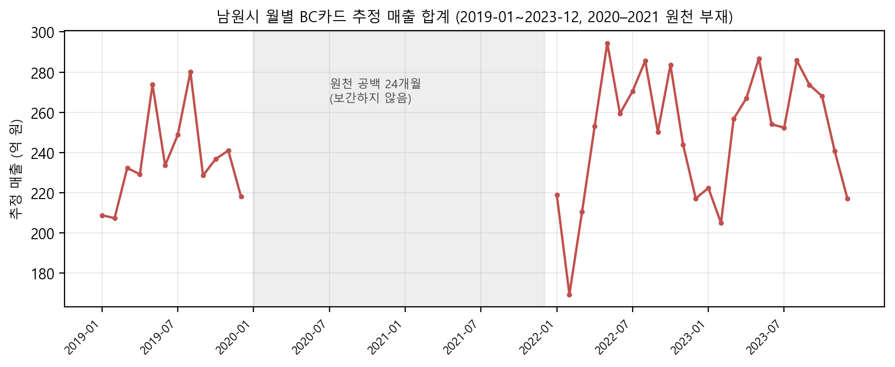
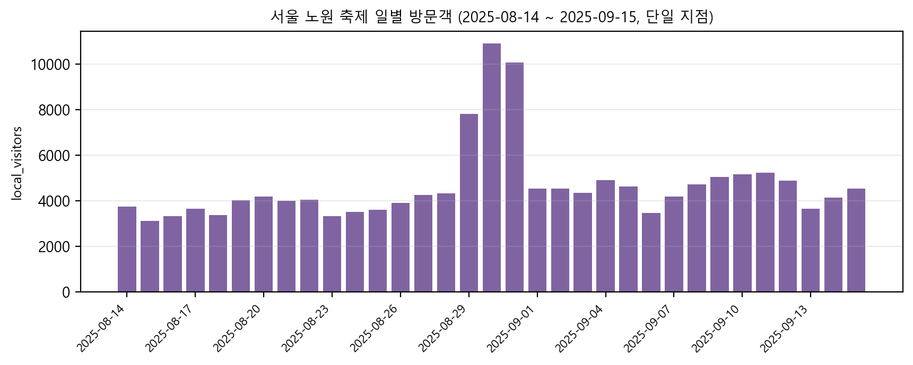
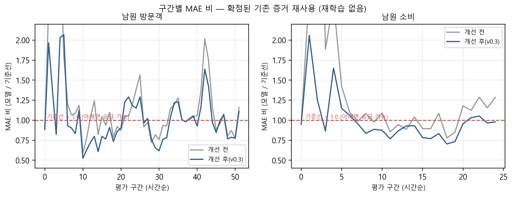

# 인구감소 R&D 플랫폼 데이터 분석 보고서

- **작성일** 2026-09-16
- **기준 커밋** `449f6aa104d31b781b3264ae67e1eb4034dac760`
- **데이터 기준** 인벤토리·품질·결합 분석은 `86f4667`에서 수행했고, 이후 커밋 `449f6aa`는 DataOps 토큰 발급 경로만 고쳐 `platform/data` 파일과 분석 수치에 영향이 없다 (데이터 파일 해시 불변).
- **대상 저장소** `F:/rnd_github/pcnrnd/Population_decline` (`platform/data`)
- **독자** 내부 연구·개발 담당자

---

## 1. 요약과 분석 범위

### 1.1 한 눈에

인구감소 플랫폼이 보유한 **전처리 데이터 41개 CSV·281,536행**을 데이터셋 단위로 점검했다. 결론은 네 가지다.

1. **네 데이터셋은 서로 다른 지역·입도·관측 단위를 가진다.** 남원(전북) 월×행정동, 강원 월×시군구, 서울 노원 일×단일 지점이다. 하나의 표로 합칠 수 있는 조합은 **남원 2종뿐**이다.
2. **품질은 데이터셋마다 크게 다르다.** 남원 KT 방문객은 58개월×23동 격자가 결손 없이 완전하다. 남원 BC카드는 **2020~2021년 24개월이 원천 추출본에 없다**. 강원 GWTO는 표마다 유효 시작월이 9종으로 갈린다.
3. **적재 가능 범위와 분석 도달 범위가 다르다.** 적재 도구는 4개 패밀리를 모두 지원하지만, 분석·모델 API가 읽을 수 있도록 허용된 테이블은 **남원 3개뿐**이다. 강원·노원 데이터는 현재 모델 경로에 도달하지 못한다.
4. **2026-09-16 모델 검증은 남원 3개 테이블만 다뤘다.** 전체 데이터가 모델로 검증되었다는 뜻이 **아니다**.

### 1.2 분석 범위

포함: `platform/data/real`(원천 8건)과 `platform/data/prepared`(41 CSV) 전체.

제외와 사유:

| 경로 | 파일 | 제외 사유 |
|---|---|---|
| `./data` | 1 | gitignore된 레거시 폴더, 플랫폼 데이터 계약 밖 |
| `./archive/data` | 12 | 초기 탐색 아카이브, gitignore |
| `./data_version` | 15 | DVC 추적 내용이 리츠(REIT) 공시 PDF로 인구감소와 무관 |

**로컬 미확보·외부 연결만 있는 자료는 없다.** 분석에 쓴 모든 파일은 로컬에 존재하며 해시를 고정했다. 다른 프로젝트의 원천으로 확장하거나 새로 데이터를 수집하지 않았다.



**그림 1.** 원천에서 모델까지의 데이터 계보와 도달 범위

---

## 2. 원천 데이터와 결합 구조

### 2.1 데이터셋 사전

| 데이터셋 | 지역 | 입도 | 관측 단위 | 기간 | 표 | 행 |
|---|---|---|---|---|---|---|
| `namwon_kt_visitors` | 전북 남원시 23개 행정동 | 월 | (base_ym, dong_code) | 2019-01~2023-10 | 2 | 22,676 |
| `namwon_bccard_consumption` | 전북 남원시 23개 행정동 | 월 | (base_ym, 고객유형, dong_name, 업종, 성별, 연령, 요일) 7부 키 | 2019-01~2023-12 | 2 | 212,368 |
| `gwto_kt_tourism_indicators` | **강원도 18개 시군구** | 월(1개 표는 일) | 표마다 다름 — 도·시군구·관광지점 | 2020-01~2025-12 | 26 | 21,887 |
| `nowon_kt_festival` | **서울 노원구 단일 축제 지점** | **일** | (date, spot_name) | 2025-08-14~2025-09-15 | 11 | 24,605 |

### 2.2 원천 · 전처리 · 파생 구분

- **원천(8건)**: `namwon_kt_visitors_20231130.xlsx`, `namwon_bccard_consumption_240130.xlsx`, `gwto_kt_tourism_indicators_202512.xlsx`, `nowon_kt_festival_20250919.xlsx`, `admin_boundary_kostat2013.geojson`, 남원·신안 복지시설 CSV 2건, `README.md`.
- **전처리(41 CSV)**: `MANIFEST.csv`가 표마다 `rows_in / rows_out / rows_dropped / transforms / key_columns`를 기록한다. 남원 2종은 `column_rename;type_fix`만 적용되어 **값 변경이 없다**.
- **파생**: 분석·모델이 쓰는 스냅샷은 전처리 CSV를 PG에 적재한 뒤 `(base_ym, dong_code)` 단위로 집계해 만든다. 소비는 `sum(sales_est_krw)` 집계가 필요하다.
- **중복 사본**: `platform/data/prepared` 내에 동일 내용의 중복 사본은 없다. 원천 xlsx와 전처리 CSV는 별개 계층이며 중복이 아니다.

### 2.3 단위

방문객·축제 계열은 **명**, 소비는 **원(추정 카드 매출)**, GWTO는 표에 따라 명·원·비율·순위가 섞인다. **단위가 다른 값을 직접 비교하지 않는다.**

### 2.4 실제 테스트 사용 여부

| 데이터셋 | 적재 도구 지원 | 분석 API 도달 | 2026-09-16 검증에서 실제 적재 |
|---|---|---|---|
| `namwon_kt_visitors` | O | **O** (2개 표) | O |
| `namwon_bccard_consumption` | O | **O** (1개 표) | O |
| `gwto_kt_tourism_indicators` | O | **X** | X |
| `nowon_kt_festival` | O | **X** | X |

도달 허용 목록은 `pg_reader.ALLOWED_TABLES` 3개(`ext_kt_namwon_monthly_dong_visitors`, `ext_bccard_dong_industry_sales`, `ext_kt_namwon_visitors_by_sex_age`)로 고정되어 있다.

---

## 3. 데이터 품질

### 3.1 누락 월과 지역

| 데이터셋 | 기대 월 | 실제 월 | 누락 |
|---|---|---|---|
| 남원 KT 방문객 | 58 | 58 | **0** |
| 남원 BC카드 소비 | 60 | 36 | **24 (2020-01~2021-12)** |
| 강원 GWTO | 표마다 상이 | 표마다 상이 | 아래 3.6 |
| 서울 노원 축제 | 33일 | 33일 | 0 |

남원 KT는 58개월 × 23동 = **1,334행이 격자를 정확히 채운다**(결손 0).

남원 BC카드의 24개월 공백은 **원천 추출본 자체에 2020·2021년 행이 없기 때문**이다(연도별 행수: 2019년 67,879 / 2022년 74,045 / 2023년 70,418). 전처리 결함이 아니므로 **보간·제로채움하지 않는다.**



**그림 2.** 데이터셋별 관측 기간과 관측 단위 (빗금 = 원천 공백 2020–2021)

### 3.2 중복 키

- 남원 KT `(base_ym, dong_code)` 중복 **0**
- 남원 BC카드 7부 키 중복 **0**
- 강원 GWTO 내비 순위표 2건에 중복 존재: `23_s4_1_navi_top500_prev_month.csv` **2건**, `24_s4_2_navi_top500_prev_year.csv` **3건**. 순위 표 특성상 동명 지점이 복수 행으로 들어온 것으로 보이며, 이 두 표를 키 기준으로 조인할 때 주의가 필요하다.

### 3.3 조인 카디널리티와 행 증식

남원 KT는 `(월, 동)`당 **1행**이다. 남원 BC카드는 같은 키에 대해 **최소 3행 · 중앙값 216행 · 최대 693행**을 갖는다(고객유형×업종×성별×연령×요일 차원).

따라서 두 표를 **원시 상태로 조인하면 최대 693배 행 증식**이 발생한다. 반드시 BC카드를 `(base_ym, dong)` 단위로 먼저 집계해야 하며, 현재 스냅샷 생성 로직이 이 집계를 수행한다.

### 3.4 결측 vs 진짜 0

두 개념을 구분해야 하며, 이 데이터에서는 서로 다른 형태로 나타난다.

- **진짜 0**: 남원 KT `foreign_visitors`에 **169건의 0**이 있다. 빈 셀이 아니라 관측된 0이며, 외국인 방문이 없었던 (월, 동)을 뜻한다. 결측 처리 대상이 아니다.
- **비어 있음**: 남원 KT·BC카드 모두 숫자 컬럼에 비숫자·빈 셀이 **0건**이다. 음수도 0건이다.
- **행 자체의 부재**: 결측은 값이 아니라 **행의 부재**로 나타난다. 집계 행이 없는 (월, 동)은 스냅샷에 들어가지 않는다.

여기서 **모델 피처의 전년동월 결측 표시(`has_yoy`)와 소비 2020~2021 원천 공백은 서로 다른 문제**다.

| 구분 | 소비 2020~2021 공백 | 전년동월 결측 flag |
|---|---|---|
| 정체 | 원천 추출본에 24개월의 **행이 없음** | 특정 표본에서 t−12 관측을 **참조할 수 없음** |
| 원인 | 데이터 제공 범위 | 계열 시작 직후 또는 위 공백을 가로지르는 구간 |
| 처리 | **보간하지 않음.** 행을 만들지 않는다 | `has_yoy=0`으로 표시하고 `y_yoy`를 같은 행 `y_lag1`로 대체 |
| 근거 | 원천 연도별 행수 확인 | 대체값은 t−1 값이므로 미래 정보가 들어가지 않음 |

전자는 **데이터에 없는 것을 만들지 않는다**는 원칙이고, 후자는 **있는 정보로 표시하고 대체한다**는 처리다. 둘을 같은 문제로 묶지 않는다.

### 3.5 단위·코드 변화

- 남원 KT는 행정동 코드(`dong_code`, 8자리)를, BC카드는 행정동 **이름**(`dong_name`)을 쓴다. 대응표 `namwon_dong_map.json`이 **23개를 모두 매핑**하며 미매핑 0건이다.
- 방문객 값이 소수점을 포함한다(예: 최소 4,637.5). 추정·보정된 값이므로 정수 카운트로 취급하지 않는다.
- 소비 금액 범위는 44원~361,841,766원으로 5자리 이상 폭이 넓다. 로그·정규화 없이 단순 합산 비교를 하면 대형 동이 지표를 지배한다(3.7 참조).

### 3.6 강원 GWTO의 유효 구간 이질성

26개 표의 **유효 시작월이 9종**(202001, 202003, 202102, 202301, 202310, 202401, 202412, 202502, 202511)으로 갈린다. 종료월은 202412 또는 202512다.

즉 **표마다 분모가 다르다.** 같은 축에 올려 비교하려면 구간을 다시 맞춰 명시해야 한다. 또 `19_s3_4_city_hour.csv`와 `21_s3_6_city_region.csv` 2건에는 기간 컬럼이 없어 시계열 축에 올릴 수 없다.



**그림 3.** 강원 GWTO 지표 테이블별 유효 구간 — 시작월이 제각각이라 분모가 다르다

### 3.7 지역 편중

남원 23개 행정동은 고르게 분포하지 않는다.

- 방문객: 상위 1개 동이 **12.6%**, 상위 5개가 **48.0%**, 하위 5개는 합쳐서 **5.2%**
- 소비: 상위 1개 동(도통동)이 **20.8%**, 상위 5개가 **65.8%**



**그림 4.** 남원 23개 행정동의 점유율 편중 — 각 지표를 자기 합계로 정규화한 값 (단위가 달라 절대량 비교 아님)

이 편중은 6장에서 모델 오차 구조와 연결된다.

---

## 4. 기간·지역·지표 탐색 분석

**아래 각 절은 해당 데이터셋 안에서만 읽는다.** 한 데이터셋에서 얻은 결론을 다른 지역·다른 입도의 데이터셋으로 옮기지 않는다.

### 4.1 남원 방문객 (월 × 23동)

23개 동 합계 기준 월별 외지인 방문객은 뚜렷한 연주기를 보이며, 2020년 전후로 수준이 낮아졌다가 회복하는 형태다. 표본 수 1,334행, 분모는 58개월 × 23동이다.



**그림 5.** 남원시 월별 외지인 방문객 합계 (23개 행정동 합, 2019-01~2023-10)

동별 평균 규모는 4,637.5명에서 274,683.5명까지 분포해 약 59배 차이가 난다.

### 4.2 남원 소비 (월 × 23동)

월 합계 추정 매출은 2019년 약 208~280억 원 구간에서 움직이고, 24개월 공백 뒤 2022~2023년에는 169~294억 원 구간이다. **공백을 사이에 둔 두 구간을 연속 추세로 읽지 않는다.**



**그림 6.** 남원시 월별 BC카드 추정 매출 합계 (2019-01~2023-12, 2020–2021 원천 부재)

### 4.3 강원 GWTO (월 × 18시군구)

26개 표가 방문객·소비·숙박·거주지·내비 검색 등 서로 다른 지표군을 담는다. 유효 구간이 표마다 달라(3.6) 전체를 한 축에 올린 종합 추세는 만들지 않았다. **남원에서 관찰된 계절성·편중을 강원에 적용하지 않는다.**

### 4.4 서울 노원 축제 (일 × 단일 지점)

2025-08-14~2025-09-15의 **33일** 구간, 단일 축제 지점이다. 일별 방문객과 시간대·성연령·국적·체류시간 표가 함께 있다.



**그림 7.** 서울 노원 축제 일별 방문객 (단일 지점)

한 달 남짓한 단일 지점 자료이므로 **월 단위 패널이나 지역 비교에 쓸 수 없다.**

---

## 5. 테스트 데이터 구성과 누수 점검

### 5.1 구성

현재 모델이 쓰는 테스트 데이터는 남원 2종에서 만든 `(base_ym, dong_code)` 패널이다.

| 타깃 | 원시행 | 피처행 | lag 연속성 제외 | 최신 학습/평가 | 유효 평가창 |
|---|---|---|---|---|---|
| `nonlocal_visitors` | 1,334 | 1,265 | 69 | 1,196 / 69 | 52 (2019-07~2023-10) |
| `observed_sales_krw` | 828 | 690 | 138 | 621 / 69 | 25 (2019-07~2023-12) |

피처는 30개(`y_lag1~3`, `y_yoy`, `has_yoy`, `month_sin`, `month_cos` + 행정동 one-hot 23)다.

**적재 원천 행수와 분석 관측행을 혼동하지 않는다.** 2026-09-16 검증의 PG 적재 235,018행은 원천 3개 테이블의 행수이고, 위 828·1,334행은 집계 후 관측행이다.

### 5.2 분할

학습 `base_ym ≤ T−3`, 평가 `{T−2, T−1, T}`(69행 = 23동 × 3개월), 예측 대상 `T+1`. 예측 시점(T)을 굴리며 반복한다.

### 5.3 누수 점검 결과

| 점검 | 결과 |
|---|---|
| 학습 최대월 ≤ T−3 | PASS |
| 평가 최소월 > 학습 최대월 | PASS |
| train/eval 월·행키 교집합 | 0 (PASS) |
| 학습 집합에 미래월 포함 | 없음 (PASS) |
| 표준화·동별 통계 산출 범위 | 학습행만 사용 (PASS) |
| 변이 선택이 평가창을 관측 | 안쪽 구간만 사용 (PASS) |

표본 t의 모든 피처는 `base_ym < t` 관측만 쓴다. 전년동월 대체값도 같은 행의 `y_lag1`이라 미래 정보가 아니다.

### 5.4 홀드아웃에 대한 사실 정정

유효 평가창은 방문객 52개·소비 25개이며, 이 중 **방문객 18개·소비 6개 구간은 변이 탐색에서 한 번도 채점되지 않았다**. 그러나 이 미관측 구간은 **전부 선택집합보다 시간상 앞선다.** 이를 홀드아웃으로 잠그면 미래로 고르고 과거에서 시험하는 형태가 되어 시계열 분할 원칙에 어긋난다.

따라서 **유효한 전방 홀드아웃은 현재 데이터에서 만들 수 없다.** 이미 관측한 말기 구간을 미사용 홀드아웃으로 재분류하지 않는다. 대신 안쪽 구간으로만 변이를 고르고 바깥 구간을 한 번 채점하는 중첩 시간 검증을 썼다.

---

## 6. 확인된 모델 결과와 데이터 한계의 연결

**이 장은 남원 2개 모델에 한정된다. 전체 데이터가 모델 검증을 통과했다는 의미가 아니다.** 아래 수치는 2026-09-16에 고정된 기존 증거이며, 이 보고서를 위해 재학습하지 않았다.

### 6.1 확정된 결과

| 모델 | 최신 전체구간 판정 | MAE / 기준선 |
|---|---|---|
| `namwon-observed-sales-next-month` | **승급** | 102,928,071.82 / 105,160,382.54 (비 0.9788) |
| `namwon-nonlocal-visitors-next-month` | **미달, 정상 거부(HTTP 400)** | 7,675.788289 / 6,921.123188 (비 1.1090) |

기준선은 `y_yoy`(없으면 `y_lag1`)를 쓰는 동별 단순 예측이고, 승급 조건은 **후보 MAE < 기준선 MAE**다. 이 조건은 이번 작업에서 바꾸지 않았다.



**그림 8.** 구간별 MAE 비 — 확정된 기존 증거 재사용 (재학습 없음)

### 6.2 데이터 한계와의 연결

3장에서 확인한 두 가지 데이터 특성이 모델 오차 구조와 직접 연결된다.

**(가) 소비의 24개월 공백 → 전년동월 참조 불가 비율.** 소비 학습행 621개 중 **414개(66.7%)**가 `has_yoy=0`이다(방문객은 1,196개 중 207개, 17.3%). 과거에는 이 경우 `y_yoy`에 리터럴 0을 넣었는데, 원척도가 약 10⁹인 열에 2/3가 0 스파이크로 들어가 공유 기울기를 왜곡했다. 같은 행 `y_lag1`로 대체하자 구간별 통과가 **10/25 → 13/25**로 올랐다.

**(나) 지역 편중 → 소수 동이 오차를 지배.** 3.7에서 본 편중 때문에, 23개 동에 하나의 기울기를 공유하는 선형 모델에서는 대형 동의 잔차가 비례해 커진다. 개선 전 실패 구간에서 방문객 45190460 한 동이 전체 MAE 격차를 혼자 초과했고, 소비는 도통동(45190370)이 격차의 약 절반을 차지했다.

이 진단에 따라 승급 지표(MAE, 조건부 중앙값)와 학습 목적(제곱오차, 조건부 평균)의 불일치를 맞추자 구간별 통과가 소비 **10/25 → 18/25**, 방문객 **21/52 → 30/52**로 올랐다. 안쪽 구간만으로 변이를 고른 중첩 검증에서는 소비 10/12, 방문객 7/12였다.

**주의**: 위 수치는 관측된 연관과 확인된 처리 효과다. "공백이 성능 저하의 원인이다"처럼 단일 원인으로 단정하지 않는다.

### 6.3 남은 한계

1. 변이 후보 목록 자체가 사전 탐색 이후에 설계되어, 중첩 검증으로도 제거되지 않는 편향이 남는다.
2. 방문객 모델은 개선되었으나 중첩 검증 평균 비가 1.0393으로 여전히 1을 넘어 **안정적 통과가 아니다.** 현재 거부 상태가 정상이다.
3. 강원·노원 데이터는 모델 경로에 도달하지 않아 **어떤 모델 판정도 받지 않았다.**

---

## 7. 통합 활용 가능성과 개선안

### 7.1 결합 가능성 판정

| 조합 | 결합 | 사유 |
|---|---|---|
| 남원 KT × 남원 BC카드 | **가능** | 지역 체계·입도·키 호환. BC를 `(월, 동)`으로 **선집계 필수**(미집계 시 최대 693배 증식). 겹치는 월 34개 |
| 남원 × 강원 GWTO | 불가 | 지역 자체가 다름(전북 남원 vs 강원 18시군구). 공통 지역 키 없음 |
| 남원 × 서울 노원 | 불가 | 지역·입도 모두 다름(월 패널 vs 일 단위 단일 지점) |
| 강원 × 서울 노원 | 불가 | 지역·입도 모두 다름 |

남원 2종을 결합하더라도 한쪽은 방문객 수, 다른 쪽은 추정 매출로 **측정 대상이 다르다.** 동반 움직임 기술까지는 가능하나 인과 주장 근거로 쓰지 않는다.

### 7.2 데이터셋별 활용 판정

| 데이터셋 | 판정 | 근거 |
|---|---|---|
| `namwon_kt_visitors` | **학습 + 검증** | 58개월×23동 격자 완전, 검증된 모델의 타깃 |
| `namwon_bccard_consumption` | **학습 + 검증** (공백 명시) | 집계 후 월×동 패널. 24개월 공백으로 가용 학습월이 60개월 중 36개월 |
| `gwto_kt_tourism_indicators` | **참고용** | 지역이 다르고 관측 단위가 혼재. 방법 비교 참고는 가능하나 남원 모델의 학습 데이터가 아님 |
| `nowon_kt_festival` | **사용 곤란** | 단일 지점 33일. 패널 구조 없음, 남원 월 단위 타깃과 겹침 없음 |

### 7.3 개선안

1. **소비 원천 2020~2021 확보 검토.** 가장 큰 제약이며, 확보되면 `has_yoy=0` 비율 66.7%가 크게 낮아진다. 보간이 아니라 원천 확보가 유일한 정공법이다. *(범위 밖 판단 — 사용자 결정 사항)*
2. **방문객 모델 후속 개선.** 지역 편중을 직접 다루는 구조를 더 탐색한다. 규모 기반 2·3군 부분공유는 이번에 기각되었으므로 다른 축이 필요하다.
3. **강원·노원 데이터의 위치 재정의.** 현재 적재는 되지만 분석에 도달하지 못한다. 참고용으로 남길지 도달 허용 목록을 넓힐지 결정이 필요하다.
4. **GWTO 유효 구간 메타데이터화.** 표별 시작월이 9종이라 분석 때마다 재확인이 필요하다. 구간 메타를 스키마에 고정하면 반복 비용이 준다.

---

## 8. 부록 — 재현 절차

### 8.1 그림 재생성

```powershell
Set-Location F:/rnd_github/pcnrnd/Population_decline
$A = "docs/reports/2026-09-16-인구감소-데이터분석보고서-자료"
python -X utf8 "$A/make_charts.py" "$A"          # 차트-01 ~ 차트-07 (PNG + CSV)
python -X utf8 "C:/Users/PCN/.claude/skills/tech-doc/scripts/mermaid_to_pptx.py" `
  "$A/그림-01.mmd" "$A/그림-01.pptx" "그림 1. 원천에서 모델까지의 데이터 계보와 도달 범위"
# 그림-01.pptx 1번 슬라이드를 1600x900 PNG로 내보낸다
```

각 차트는 그린 값을 그대로 담은 `차트-NN.csv`를 함께 만든다. 그림 대장은 `figures.json`에 있다.

### 8.2 분석 재생성

| 산출물 | 스크립트 | 결과 |
|---|---|---|
| 전체 인벤토리 | `inventory.py` | `stage6-full-data/inventory.json` |
| 데이터셋별 품질·탐색 | `quality.py` | `stage6-full-data/quality.json` |
| 결합 가능성 | `integration.py` | `stage6-full-data/integration.json` |

증거 루트: `F:/etc/review-system/artifacts/active/operations/20260916-population-completion/`

### 8.3 모델 결과 출처

6장 수치는 아래 고정 증거에서 가져왔으며 이 보고서를 위해 재학습하지 않았다.

- `stage4-model/grid.json` — 변이 × 구간 전체 격자
- `stage4-model/nested-validation.json` — 중첩 시간 검증
- `stage5-integration/machine-evidence/verify-result.json` — 격리 PostgreSQL 실검증 95건

### 8.4 미확정 항목

- 표지의 작성자·부서·승인자 인적 정보는 확인되지 않아 **비워 두었다.** 임의로 채우지 않는다.
- 회사/과제 지정 템플릿 경로가 지정되지 않아 `tech-doc` 기본 템플릿을 사용했다.
